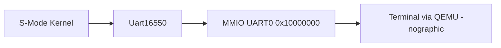

# tg-rcore-tutorial-uart

[](https://crates.io/crates/tg-rcore-tutorial-uart)
[](https://docs.rs/tg-rcore-tutorial-uart)

`tg-rcore-tutorial-uart` 是一个面向 rCore 教学实验的极简 UART16550 串口驱动组件，运行于 `no_std` 环境，可用于 RISC-V S 态内核直接通过 MMIO 输出字符。

## 目标

- 提供可复用的串口输出组件 crate
- 适配 QEMU `virt` 平台 UART0（基址 `0x10000000`）
- 支持 `cargo test` 的单元测试验证
- 满足发布到 crates.io 的基础元信息要求

## 架构



## 使用示例

```rust
use tg_rcore_tutorial_uart::Uart16550;

let uart = Uart16550::qemu_virt();
uart.putstr("Hello, UART!\n");
```

## 测试

```bash
cargo test
```

## License

GPL-3.0
